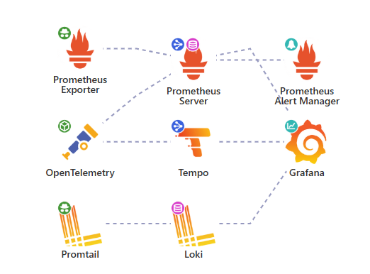
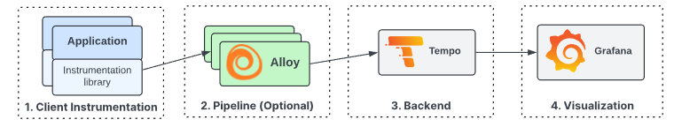

# Projeto de observabilidade ( logs-traces-métricas).
- Fase: Em revisão de documentação

## Objetivos 

- Criar uma stack completa de observabilidade.
- Atingir os 3 pilares da observabilidade: Logs, métricas e tracing.
- Ter envio de alertas baseados em métricas
- Os dados coletados precisam ter persistência ( disco rígido ou  buckets). 
- Todo o processo deve estar documentado e ser replicável.
   - Dados sensíveis não devem estar no repositório, mas o readme deve indicar sua configuração. 
###
- [Instalção no kubernetes via shellscript](#instalação)
- [Acompahe as etapas](#etapas)
### Stack de observabilidade utilizada: 
     

### Diagrama da stack


### Documentação da stack
- [OpenTelemetry SDK](https://opentelemetry.io/) - Para instrumentar a aplicação
- [OpenTelemetry Collector](https://opentelemetry.io/docs/collector/) - Coletar métricas, traces, logs e enviar ao backend correspondente.
- [Prometheus](https://prometheus.io/docs) - Exporter de métricas kubernetes e backend de métricas
- [Grafana Loki](https://grafana.com/docs/loki/latest/) - Backend de logs
- [Grafana Tempo](https://grafana.com/docs/tempo/latest/) - Backend de tracing
- [Grafana](https://grafana.com/docs/grafana/latest/) - Dashboards
- [Openapm - Diagrama e Recursos](https://openapm.io/landscape)


### Repositórios Relacionados:
- Abaixo aplicação usada como base para esse laboratório, objetivo é aplicar conceitos de observabilidade na configuração de ambiente e não programação em sí. 
- [Frontend](https://github.com/Adenilson365/devopslabs01-frontend)
- [Backend - Catalogo](https://github.com/Adenilson365/devopslabs01-serviceMesh)
- [Backend - Api de Imagens](https://github.com/Adenilson365/devopslabs01-api-images)
- [Terraform - IAC](https://github.com/Adenilson365/devopslabs01-iac)


## Instalação:
- execute o script **install.sh**
- Para GCP - Execute o terraform conforme este [repositório](https://github.com/Adenilson365/devopslabs01-iac) ou rode em k8s local em ambos siga o próximo passo do diretório config.
  - Nesse momento é necessário liberar no GCP SQL um acesso para a rede do GKE, quando estiver via Terraform essa observação será apagada.
  - É necessário criar o usuário para a aplicação usar, com mesmo nome e senha do secret do catalogo, pode fazer isso via console GCP.
- Crie os arquivos segundo o readme do diretório config
- DNS: Precisa apontar seu registro A api e obs para o ip do loadbalancing provisionado pelo nginx, ou configure como preferir. 
- DNS e Liberação SQL são as configurações manuais presentes no momento, o restante está via script shell.

### Instalação Grafana Loki 
[Repositório Artifacthub](https://artifacthub.io/packages/helm/grafana/loki)
```shell
helm repo add grafana https://grafana.github.io/helm-charts
helm repo update
helm install loki  grafana/loki-stack -f ./grafana-lokki/values.yaml --version 2.10.2 -n obs
```
- Instala a versão monolito com todos os componentes do grafana em um único deploy.
- Por padrão instala a depêndencia promtail para coleta de logs

- Versão [distributed](https://artifacthub.io/packages/helm/grafana/loki-distributed)
- Mesmo formato de instalação, sendo necessário instalar a parte o [promtail](https://artifacthub.io/packages/helm/grafana/promtail)
- Configurar o values.yaml do promtail para enviar logs ao loki
```YAML
config:
  clients:
    - url: http://loki-dis-loki-distributed-gateway/loki/api/v1/push

# A url deve representar o dns do gateway do loki http://<svc>.<ns>/loki/api/v1/push
# se no mesmo namespace http://<svc>/loki/api/v1/push
```


- Após instalar necessário adicionar  a fonte de dados ao Grafana 
### Problemas de instalação:
[Discussão](https://community.grafana.com/t/loki-helm-documentation-isnt-working-for-me/122777/5)
[Issue que continha solução](https://github.com/grafana/loki/issues/12711)


### Instalação stack Prometheus Grafana
[Repositório Artifacthub](https://artifacthub.io/packages/helm/prometheus-community/kube-prometheus-stack)
```shell
helm repo add prometheus-community https://prometheus-community.github.io/helm-charts
helm repo update
helm upgrade --install prometheus prometheus-community/kube-prometheus-stack --version 67.5.0 --namespace obs --create-namespace -f ./kube-prom-stak/prom-values.yaml --wait
```

## Grafana Tempo ( Tracing )
###
### Arquitetura Tempo



```shell
helm repo add grafana https://grafana.github.io/helm-charts
helm install tempo grafana/tempo -n obs
```

### Documentação
[Opentelemetry como pipeline](https://grafana.com/blog/2021/04/13/how-to-send-traces-to-grafana-clouds-tempo-service-with-opentelemetry-collector/)

### Configuração OpenTelemetry-collector
###
- Para **teste local** implante no docker compose essa imagem: [grafana/otel-lgtm](https://hub.docker.com/r/grafana/otel-lgtm)
    - Essa imagem contém a stack completa (OpenTelemetry, Loki, Prometheus, Grafana, Tempo)
    - Precisa expor no compose as portas 4317 (opentelemetry) e 3000 (Grafana dashboard)
    - Não é necessário nenhum tipo de configuração apenas apontar a instrumentação para a porta 4317.
    ```YAML
    #Compose da stack otel-lgtm
    otel:
      image: grafana/otel-lgtm
      ports:
        - 4317:4317 # Opentelemetry gRpc
        - 3000:3000 # Grafana Dashboard
    ```

### Configurar no k8s
###

- [Helm Opentelemetry-collector](https://artifacthub.io/packages/helm/opentelemetry-helm/opentelemetry-collector)
```shell
helm repo add open-telemetry https://open-telemetry.github.io/opentelemetry-helm-charts

helm upgrade --install my-opentelemetry-collector open-telemetry/opentelemetry-collector \
--set mode=deployment --set image.repository="otel/opentelemetry-collector-k8s" --set command.name="otelcol-k8s" \
-f grafana-lokki/open-collector.yaml --version 0.111.0 -n obs
```

- Custom Values:
```YAML

config:
  exporters:
    debug: {}
    otlp: 
      endpoint: http://tempo.obs.svc.cluster.local:4317  # Aponta para o serviço do grafana tempo
      tls: 
        insecure: true
  receivers:
    otlp:
      protocols:
        grpc:
          endpoint: 0.0.0.0:4317 # Para receber de qualquer endereço nessa porta
        http:
          endpoint: 0.0.0.0:4318
  service:
    telemetry:
      metrics:
        address: ${env:MY_POD_IP}:8888
    extensions:
      - health_check
    pipelines:
      logs:
        exporters:
          - otlp
        processors:
          - memory_limiter
          - batch
        receivers:
          - otlp
      metrics:
        exporters:
          - otlp
        processors:
          - memory_limiter
          - batch
        receivers:
          - otlp
          - prometheus
      traces:
        exporters:
          - otlp
        processors:
          - memory_limiter
          - batch
        receivers:
          - otlp
```


- A aplicação python precisa receber as variáveis de ambiente com as informações do collector
```YAML
apiVersion: v1
kind: ConfigMap
metadata:
  name: <name>
  namespace: <namespace-da-aplicação>
data:
  OTEL_SERVICE_NAME: <name-service>
  OTEL_EXPORTER_OTLP_ENDPOINT: http://<svc-opentelemetry>.obs.svc.cluster.local:4317
  OTEL_EXPORTER_OTLP_INSECURE: 'true'
  OTEL_PYTHON_LOGGING_AUTO_INSTRUMENTATION_ENABLED: 'true'
  OTEL_TRACES_EXPORTER: otlp
  OTEL_METRICS_EXPORTER: otlp
  OTEL_LOGS_EXPORTER: otlp

```


### Etapas 

- [x] Instalar a stack completa via helm
- [x] Conectar opentelemetry ao tempo
- [x] Instalar stack loki + promtail
- [x] Trocar Promtail pelo opentelemetry para logs
- [x] Implementar alertas via prometheus
- [x] Integrar prometheus, opentelemetry, tempo para gerar grafico de malha
- [x] Conectar métricas de aplicação do Opentelemetry ao prometheus
- [x] Implementar volume persistente para métricas
- [x] Implementar volume persistente para logs e traces
- [ ] Corrigir bug de métricas duplicadas no prometheus
- [ ] Revisar e alinhar a documentação

 [⬆️ Voltar ao topo](#objetivos)