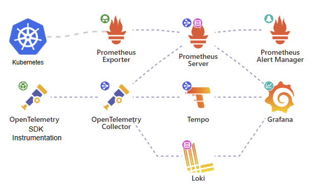

## Objetivos 

- Criar uma stack completa de observabilidade.
- Atingir os 3 pilares da observabilidade: Logs, métricas e tracing.
- Os dados coletados precisam ter persistência ( disco rígido ou  buckets). 
- Todo o processo deve estar documentado e ser replicável.
   - Dados sensíveis não devem estar no repositório, mas o readme deve indicar sua configuração. 

### Stack Inicial de observabilidade: 
    

### Diagrama da stack


### Repositórios Relacionados:
- Abaixo aplicação usada como base para esse laboratório, objetivo é aplicar conceitos de observabilidade e não programação em sí, exceto pela instrumentalização da aplicação.
- [Terraform](https://github.com/Adenilson365/devopslabs01-iac)
- [Frontend](https://github.com/Adenilson365/devopslabs01-frontend)
- [Backend - Catalogo](https://github.com/Adenilson365/devopslabs01-serviceMesh)
- [Backend - Api de Imagens](https://github.com/Adenilson365/devopslabs01-api-images)

### Documentação
- [openapm-landscape](https://openapm.io/landscape)
- [Grafana loki]
- [Opentelemetry](https://opentelemetry.io/)
- [Grafana Tempo](https://grafana.com/oss/tempo/)


### Instalação Grafana Loki 
[Repositório Artifacthub](https://artifacthub.io/packages/helm/grafana/loki)
```shell
helm repo add grafana https://grafana.github.io/helm-charts
helm repo update
helm install loki  grafana/loki-stack -f ./grafana-lokki/values.yaml --version 2.10.2 -n obs
```
- Instala a versão monolito com todos os componentes do grafana em um único deploy.
- Por padrão instala a depêndencia promtail para coleta de logs

- Versão [distributed](https://artifacthub.io/packages/helm/grafana/loki-distributed)
- Mesmo formato de instalação, sendo necessário instalar a parte o [promtail](https://artifacthub.io/packages/helm/grafana/promtail)
- Configurar o values.yaml do promtail para enviar logs ao loki
```YAML
config:
  clients:
    - url: http://loki-dis-loki-distributed-gateway/loki/api/v1/push

# A url deve representar o dns do gateway do loki http://<svc>.<ns>/loki/api/v1/push
# se no mesmo namespace http://<svc>/loki/api/v1/push
```


- Após instalar necessário adicionar  a fonte de dados ao Grafana 
### Problemas de instalação:
[Discussão](https://community.grafana.com/t/loki-helm-documentation-isnt-working-for-me/122777/5)
[Issue que continha solução](https://github.com/grafana/loki/issues/12711)


### Instalação stack Prometheus Grafana
[Repositório Artifacthub](https://artifacthub.io/packages/helm/prometheus-community/kube-prometheus-stack)
```shell
helm repo add prometheus-community https://prometheus-community.github.io/helm-charts
helm repo update
helm upgrade --install prometheus prometheus-community/kube-prometheus-stack --version 67.5.0 --namespace obs --create-namespace -f ./kube-prom-stak/prom-values.yaml --wait
```

## Grafana Tempo ( Tracing )
###
### Arquitetura Tempo


### Documentação
[Opentelemetry como pipeline](https://grafana.com/blog/2021/04/13/how-to-send-traces-to-grafana-clouds-tempo-service-with-opentelemetry-collector/)