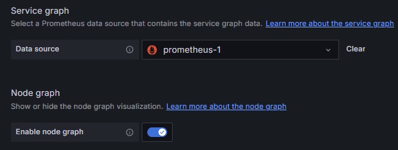
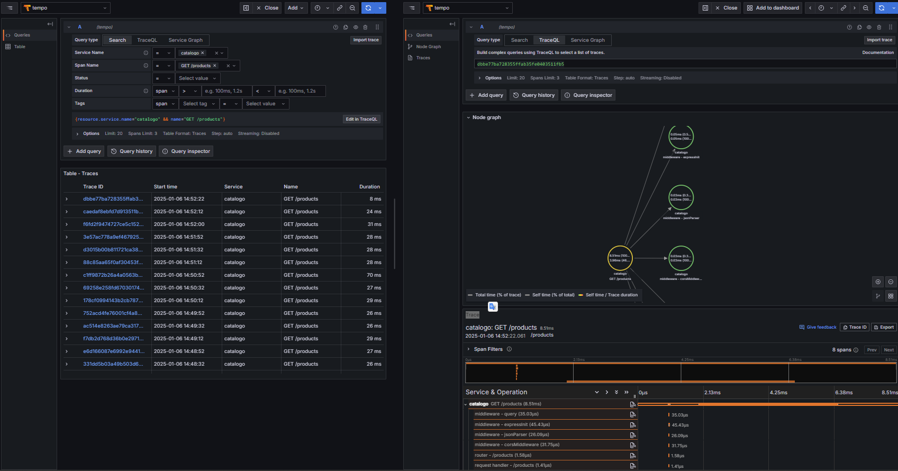

### Loki
- [Conectar Opentelemetry ao Loki](https://grafana.com/docs/loki/latest/send-data/otel/)

- [Helm Chart](https://grafana.com/docs/loki/latest/setup/install/helm/install-monolithic/)

- Para usar o distributed, o opentelemetry deve se conectar ao gateway para http.

### Grafana Dashboard

- Conexões Grafana:
    - Loki
    - http://loki.obs.svc.cluster.local:3100
    - Tempo
    - http://tempo.obs.svc.cluster.local:3100


### Conexão com prometheus:
[Link Consulta - Suporte nativo OTLP (09/2023)](https://prometheus.io/blog/2024/03/14/commitment-to-opentelemetry/)
[Link Consulta - Docs Otel](https://opentelemetry.io/blog/2024/prom-and-otel/)


### Tempo
- Habilitar o service graph [link](https://grafana.com/docs/tempo/latest/configuration/#metrics-generator)


- No values do tempo: 
```YAML
tempo:
  metricsGenerator:
    enabled: true
    remoteWriteUrl: "http://<prometheusserver>.<namespace>:9090/api/v1/write"

```
- No values do prometheus:
```YAML
prometheus:
  prometheusSpec:
     enableRemoteWriteReceiver: true
```

- Se tudo der certo deve aparecer as métricas iniciadas em traces no prometheus.
- Na UI do grafana nas configurações do datasource tempo em aditionalSettings, adicione o prometheus como datasource e marque a opção nodeGraph, como abaixo:


- Após é possível ver o serviceGraph no tempo.



### Conexão Otel + prometheus

- Foi necessário rodar o [otel-lgtm](https://hub.docker.com/r/grafana/otel-lgtm) - E usar os arquivos de configuração como norte, depois encontrar as docs abaixo: 
[Documentação prometheus](https://prometheus.io/docs/guides/opentelemetry/)
[Issue Git sobre Otlp Receiver](https://github.com/prometheus-community/helm-charts/issues/5080)
[Protocolos Otel](https://github.com/open-telemetry/opentelemetry-python-contrib/tree/main/opentelemetry-instrumentation)
[Endpoints Opentelemetry](https://opentelemetry.io/docs/specs/otel/protocol/exporter/)
[Youtube - Video de referência](https://www.youtube.com/watch?v=B-ZZk4HZrfY&ab_channel=LinhVu)


- No values do prometheus

```Yaml
prometheus:
  prometheusSpec:
    additionalArgs:
      - name: web.enable-otlp-receiver
        value: ''
```

- No values do Otel
``` YAML
# No exporter adicione esse exporter:
otlphttp/metrics:
      endpoint: http://prometheus-kube-prometheus-prometheus.obs:9090/api/v1/otlp
      tls:
        insecure: true
# Necessario adiciona-lo a pipeline também
```